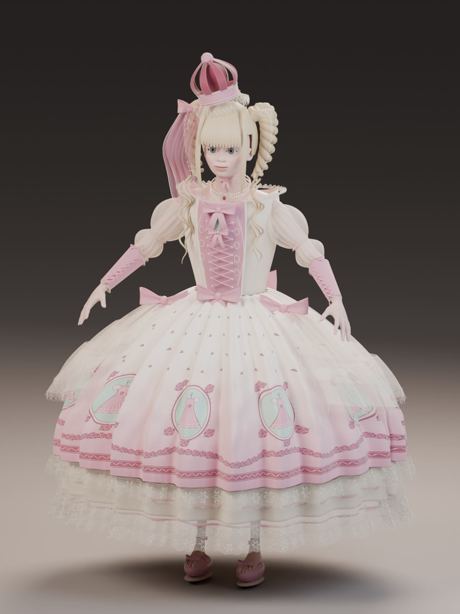

# 鹈鹕骑行测试和一次失败的 3D 建模

最近做了个鹈鹕骑车的小测试，放在这里存一下，感觉还怪有趣的。

  <iframe src="../../../assets/pelican-bike/index.html" title="鹈鹕骑行测试" loading="lazy"></iframe>

另外记一下这次失败的 3D 建模：我只提供了图纸和用 Blender 建模的要求，还让 AI 自己去网上找 skill，最后做出来的效果简直没法看。

  <figure>
    
    <figcaption>图纸。</figcaption>
  </figure>
  <figure>
    
    <figcaption>做出来的结果。</figcaption>
  </figure>

我不会 Blender，也不知道现在该从哪里修，先放着吧，等以后学会一点再回来看看。
