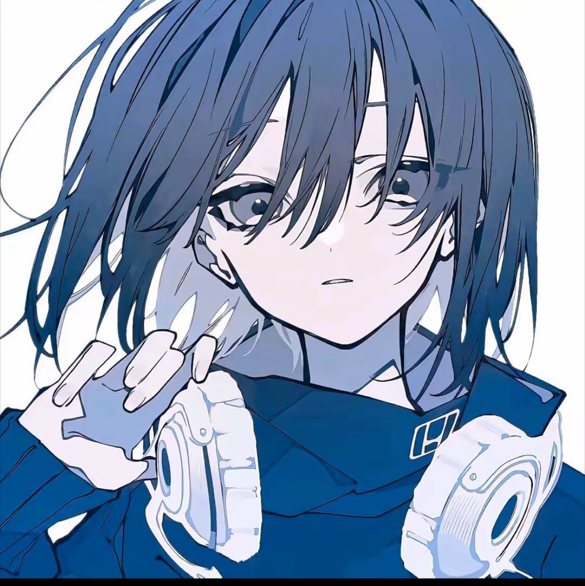

# About

  

你好，我是 **alexy-dot**。

这里是我的个人博客。我会把学习笔记、项目记录、日常想法和一些阶段性的整理放在这里。

## 关于我

我目前是人工智能专业大三本科生，很期待与每一个志同道合的人的相识。🐱

我相信技术是世界的解药，所以我选择拥抱它。✌️

我总是渴望改变，因为翻天覆地的改变意味着源源不断的希望。而这个时代如此的美好，变化无时无刻不在发生。但是我更加渴望能亲自参与变化之中。😁

## 关于这个站

我希望它不是一个很空的展示页，而是一个可以慢慢积累的地方：

- 写下学到的知识和踩过的坑
- 记录正在做的小项目和工具折腾
- 放一些阶段总结、想法和生活片段小感悟

## Contact

- GitHub: [alexy-dot](https://github.com/alexy-dot)
- WeChat: `13099035308`

希望交到新朋友，喵🐱
